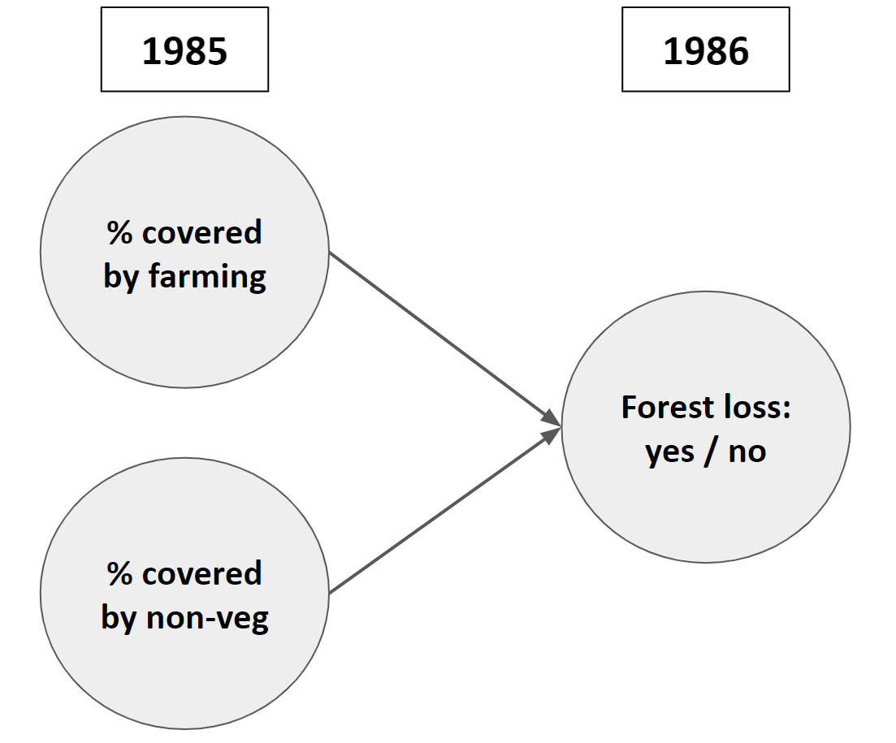

# DeepLand

For now model building is performed on only the LULC data (<a href="https://mapbiomas.org/en/download">Mapbiomas 6</a>). 
Also as a first example only considers the timesteps 1985 and 1986. The current process is as follows:

* Remaps the original <a href="https://mapbiomas.org/en/legend-codes">40+ mapbiomas classes</a> to 6 main ones (forest, non-forest vegetation, farming, non-vegetated, water, none).
* Overlays the remapped mapbiomas rasters on a coarse reference grid (900m, so 100*100 of the original 30m pixels) and calculated the % of the previous classes contained in each coarse 900m cell.
* Specifies a bayesian network in which the observations are the coarse 900m pixels. The explanatory variables are the % of the pixel covered by farming and by the non-vegetated classes in 1985. The target variable is a binary variable where 1=some amount of forest (1985) was transformed to either farming or non-vegatated (1986), 0=in any other case.

  

 

 

 
